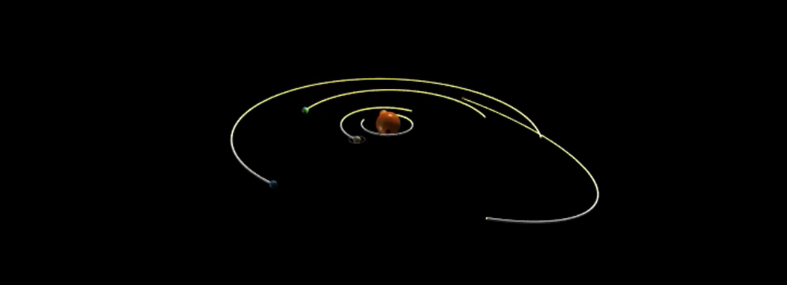

## Solar System Simulator

Welcome to the Solar System Simulator project! This Python code simulates the real-time orbitation of planets around the sun using orbital elements. It calculates the X, Y, Z positions of the planets and their distances from the sun, and visualizes the results.

## Features
* Real-time simulation: Calculate the real-time positions of planets based on their orbital elements.
  
* Visualizations: 3D graphical representation of the solar system and graphs showing the distance of planets from the sun over time.

* Interactive Controls: Choose which planets to simulate and whether to display distance graphs.

## Getting Started
### Prerequisites
* Python 3.x

* VPython library for 3D visualization

* datetime module for handling dates and times

### Installing VPython
You can install VPython using pip:
<pre>
pip install vpython
</pre>
### Running the Simulation
To run the simulation, execute the Python script:
<pre>
 Mechanics_project.py
</pre>

### Program Modes
1. The first four planets: Simulates Mercury, Venus, Earth, and Mars.

2. The last five planets: Simulates Jupiter, Saturn, Uranus, Neptune, and Pluto.

3. All: Simulates all nine planets.

### Graph Options
Choose whether to display graphs of the distance of each planet from the sun over time.

### Functions
* Julian_Date(time): Calculates the Julian century.

* POE(T): Calculates Planetary Orbital Elements.

* planet_fun(time): Calculates the planets' coordinates.

## Author
### #Navid Markazi,Isfahan University of Technology,December 2020
